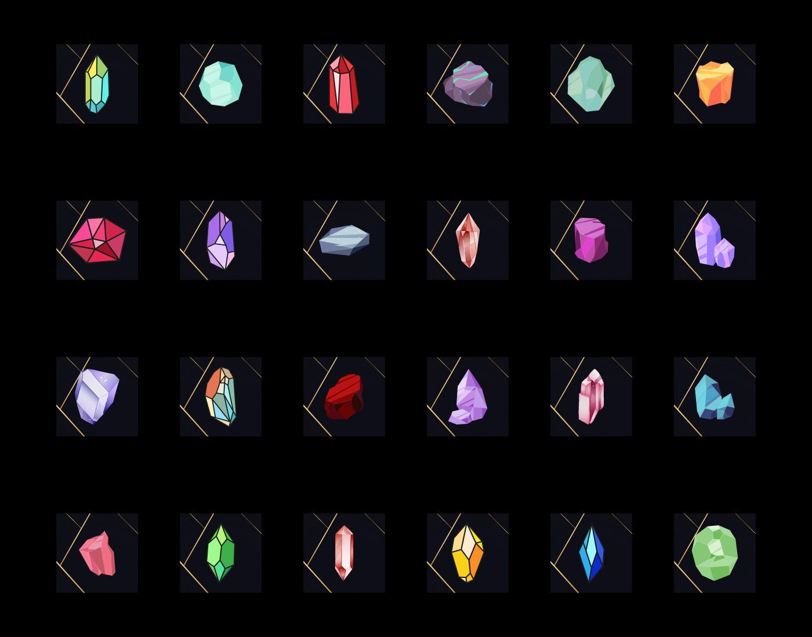

# Proyecto Topacio

<!-- ejemplo para VueJs
 

  <button @click="count -= 1">{{ count }}</button>

 -->
 
Topacio nace como una herramienta que tiene el objetivo de apoyar a los traders, inversionistas y personas que quieren empezar en el mundo de las criptomonedas a tomar las decisiones más acertadas en los diferentes escenarios de volatilidad en el mercado, con el fin de evitar perder el capital por violentos movimientos y terminar atrapado en una mala posición por mucho tiempo o teniendo que cerrar la misma en perdidas. 

Es aquí donde nacen algunos cuestionamientos:
    
- ¿Hay alguna manera de identificar el mejor precio en un activo cuando queremos abrir una posición bien sea al alza o a la baja? 
- ¿Existe alguna forma de detectar la reversión de una tendencia e irnos con el movimiento desde su origen? 
- ¿cómo podemos detectar cuando hay manipulación del precio para no caer en las trampas de aquellos que mueven el mercado? 

Estas preguntas han sido el catalizador por el cual se inició el desarrollo de esta herramienta, la cual se centra en analizar y seleccionar los mejores momentos para comprar y vender tus criptomonedas, tanto en el mercado spot como en el mercado de futuros y asi evitar los rangos. Topacio en su esencia esta enfocado para operativas de extremos y no estar metido en el mercado de continuo sino operar los mejores momentos y con las probabilidades a tu favor.

Durante mucho tiempo, luego de varias evidencias, estudios, y pruebas de personas talentosas y apasionadas, hemos recopilado suficiente información congruente; esta Información la hemos aplicado a un análisis efectivo en diversos escenarios del mercado, para desarrollar ésta poderosa herramienta que llamamos Topacio Trade; la cual procesa varias capas de información alcanzando hasta un 90% de efectividad en distintas operativas temporales, realizando lanzamientos automatizados de compra y venta de acuerdo a la configuración fijada por el mismo usuario, conforme a sus planes de trading y preferencias de inversión.

Para completar la interactividad del usuario y el ecosistema de Topacio trading y contando con múltiples propósitos, Topacio cuenta un token de gobernanza llamado "TOPACIO", ademas el usuario podrá acceder a un NFT con utilidad para usar el sistema automatizado, estos NFT's tendrán su desarrollo en  un módulo de marketplace independiente donde el trader podrá comprar y vender su NFT, o sí prefiere, podar hacer staking y recibir como recompensa el token de gobernanza. 

> Para estar al dia de las actualizaciones oficiales y eventos de `Topacio Trade`, te recomendamos seguir el canal oficial de twitter [@topacioTrade](https://twitter.com/TopacioTrade).

# Caracteristicas del proyecto Topacio

El proyecto Topacio Trading tiene la visión y el propósito de la creación de una herramienta Única, disruptiva, totalmente diferente y completamente funcional. Al ser un proyecto que corre sobre la blockchain se ha escogido como nido la cadena de bloques de Polygon, como sabemos este un proyecto de escalabilidad de capa 2 el cual permite que aplicaciones descentralizadas puedan ejecutarse en una red, su ventaja a diferencia de operar directamente sobre la red de Ethereum son menores comisiones, mayor velocidad e interoperabilidad. La dirección de billetera de la main net de Polygon es la que el usuario usara para realizar el login en el Ecosistema de Topacio. Usando asi mismo su billetera para guardar los fragmentos NFT necesarios para armar un NFT completo de TOPACIO, también la podrá usar para realizar diferentes transacciones, pagar comisiones, firmar y recibir recompensas del staking de los NFT que posea.

El usuario de topacio, al ser poseedor de estos NFT's tendrá acceso a distintas funcionalidades de trading, que dependiendo de los parámetros que el mismo asigne, podrá automatizar sus tardes tanto en spot como en futuros, tomando siempre como premisa las ventajas que nuestra plataforma ofrece, como es el comprar  y/o  vender automáticamente en puntos de quiebre absoluto del mercado para operaciones de  mediana y larga duración ( swing trading ), asi como operaciones cortas (scalping, intra day) utilizando las operaciones de extremo y asi aprovechar el movimiento en tendencia  de punta a punta.
Otra característica mas de la integración de los token no fungibles y tomando el cuenta el funcionamiento y la economía de Topacio Trading, ponemos a disposición del usuario una quema agresiva de su NFT el cual tendrá lógica de implementación a la hora de hacer crafting (módulo donde se destruirán y forjaran autenticas Gemas), generando así la quema constante y una economía sana dentro de la plataforma.

# Que son los Fragmentos de Gema NFT's

La generación génesis de fragmentos es la colección inicial representada por 24 variedades de fragmentos de gemas. Los cuales  son coleccionables, ademas a todos los holders iniciales que alcancen a reunir 8 fragmentos sin importar la variedad, pondrán mintear en su liberación un NFT Completo de Topacio (totalmente funcional), cada fragmento que “colécte” el usuario representa una de las caras del logo de topacio, en este módulo cabe destacar que al realizar el crafting del NFT de Topacio esos 8 fragmentos son quemados. Los NFT’s de Topacio son únicos ya que podrán ser de cualquier rareza y contar con distintos atributos, aumentando su escasez, exclusividad y usabilidad. 

Los fragmentos de gemas NO ESTARÁN  disponibles todo el tiempo para su minteo y crafting, ya que  en su etapa inicial se conseguirán exclusivamente en temporadas de eventos, los cuales se irán dando a conocer a los participantes interesados, todo por medio de whitelist inscribiendo sus billeteras de polygon. Esta será en principio la única forma para ingresar al proyecto de Topacio Trading.

  

<iframe width="560" height="315" style="margin: 20px 0%;" src="https://www.youtube.com/embed/QthXbOpS5AA" title="YouTube video player" frameborder="0" allow="accelerometer; autoplay; clipboard-write; encrypted-media; gyroscope; picture-in-picture" allowfullscreen></iframe>

# ¿ Qué son las Subscripciones?

Son 31 días de acceso al ecosistema de Topacio, a demas podrás unirte al canal privado de Telegram de la  comunidad exclusiva y tendrás disponible el canal del bot de notificaciones para que no te pierdas los movimientos del mercado y las mejores oportunidades que te brinda para realizar tus trades. 
Por cada subscripción el usuario obtiene un Ticket alojado en la blockchain, por cada 3 tickets acumulados podrás canjearlos por fragmentos de Gema los cuales se podrán utilizar para crear una Gema completa de Topacio, ademas podrás canjear  premios adicionales de las bóvedas de Eventos.

# ¿Como obtener fragmentos de gema?

En su etapa inicial las subscripciones se habilitarán en eventos,  por tiempo y cupos limitados, este sistema de subscripciones correrá en la blockchain de polygon. Por cada subscripción adquirida se asignará un ticket, una vez el usuario reúna 3 tickets los podrá canjear por un fragmento de gema alojado en una bóveda, la cual mensualmente se abastecerá con una cantidad de fragmentos finitos y escasos ejecutado por smart contracts.

La segunda forma de obtener fragmentos es en el módulo de crafting, cuando este se encuentre activo los usuarios que posean su NFT de Topacio podrán destruirlo, esto en caso de querer reconstruir un nuevo NFT reuniendo 8 fragmentos, haciendo esto podrá obtener una Gema con nuevos atributos y rareza, asi mismo será saludable para el ecosistema pues consistiría en la quema y escasez de una activo como lo es un NFT.

# ¿En que transformaras los fragmentos?

<iframe width="560" height="315" style="margin: 20px 0%;" src="https://www.youtube.com/embed/AhD9VKwnyGA" title="YouTube video player" frameborder="0" allow="accelerometer; autoplay; clipboard-write; encrypted-media; gyroscope; picture-in-picture" allowfullscreen></iframe>

# ¿Qué pasa con mis tickets, si se agotaron los fragmentos disponibles en ese mes?

Si al momento de querer cambiar un ticket ya no hay fragmentos disponibles, también existirá un módulo de recompensas, donde existirán distintos premios, como la extensión de una subscripción, NFT's de diferentes tipos, fragmentos, NFT's funcionales y cajas sorpresas.

Dependiendo de la recompensa se pedirán un numero de tickets determinados, ya que no todas estas son de un valor único.

# Tokenomic

 

* Distrubucion y token de gobernanza

Todo el ecosistema de Topacio contará con la siguiente distribución, regido por su token de gobernanza 100% funcional y de utilidad real, en algunos casos brindando rendimientos en su ecosistema DEFI en Staking Block y Flexible.

- 10% Equipo - Bloqueado a 18 meses. transcurrido el periodo de Bloqueo max 20% cada 3 meses ( equivalente 2% ).
- 5% Plataforma del ecosistema Topacio, escalabilidad y Desarrollo.
- 30% Modulo Staking Bloquedo - bobeda de Staking Dedicada APIS de rendimiento Anual y Flexible.
- 12% Framing.
- 3% Ronda Semilla Bloqueado (12 meses).
- 5% Venta Privada Bloqueado (12 meses).
- 5% Venta Publica (Pancakageswap).
- 1% AirDrop Financiado por Parners.
- 5% parners inversion privada (Bloqueado a 12 meses) liberacion 25% cada 3 meses
- 5% Marketing
- 5% Recompensas plataformas y eventos distribuidos a 12 meses  durante el primer a#o ( 0.416% maximo mensual en ecosistema Topacio )
( recompensas por duracion de staking [bonus] / trades exitosos / Eventos / financiacion de NFT's otorgados en eventos )
- 4% Tesoreria.
- 10% Bloquedo negociacion exchanges max 3% por exchange.

    <canvas id="tokenomic-chart" width="400" height="400"></canvas>

#  Ecosistema Topacio

El cosistema Topacio Trade contará con su Token de gobernanza  nativo (TOPACIO) el cual tendrá uso 100% integrado a todo su ecosistema, el cual poseerá un entorno rico en funcionalidades y uso en el mundo real. Cuando un usuario, poseedor de un NFT de Topacio quiera colocar automatizaciones de acuerdo a sus preferencias Gustos y estrategias, lo hará en forma de transacción en la blockchain de polygon, esta transacción se firmara desde su billetera web3 descentralizada y se cobrara una pequeña comisión en el Token de Gobernanza TOPACIO.

El usuario contará con un Marketplace independiente, desde el cual podrá Obtener un NFT de Topacio, para realizar dicha transacción el token que utilizara para pagar por este activo será el token de gobernanza TOPACIO, incentivando su uso y consumo.
Cabe destacar que al alcanzar un minteo sobre los primeros 1000 NFT generados exclusivamente se podrán mintear con Topacio Token de gobernanza. Los NFT de su temporada Génesis será publicada y abierto el mint por periodos cortos y en eventos exclusivos.

Dando uso completo y demanda de su Token en todo su ecosistema, aparte de su funcionalidad y consumo activo, el token Topacio es sumamente escaso he incentiva el Staking para todos sus holder, con bóvedas de staking bloqueado contaran con rendimientos tanto anuales, en sus módulos de staking y framing pudiendo potenciar tu staking agregando tus NFT.

# Utilidad del token
    
    ¿Cuál será la utilidad del token; es decir, 
    cuál es el valor de poseer el token o será de especulación? 
    ¿Para qué se usa el Token?.

- Fungira como Token único de gobernanza, con la existencia única de 100.000.000 (100 millones de tokens únicamente) .

- A futuro exclusivamente se adquirirán o pagarán las suscripciones a la plataforma Topacio únicamente con topacio, es decir las personas que deseen suscribirse, necesitarán pagar su suscripción en Topacio, ocasionando demanda del mismo  y necesidad del token, Ejemplo si la suscripción mensual sale en 15$, deberán tener el equivalente a 15$ en Topacio (Demanda continua de Topacio). 

- El NFT para su Adquisición después de la venta semilla  exclusivamente  se podrá adquirir con Topacio (Deberán comprar su Token de Gobernanza), con este NFT es con que se podrán acceder a las automatizaciones, cuando estén listas (Más Demanda por Topacio).

- cuando se lance la venta pública del token en panckageSawp se podrá comprar y vender libremente y las personas podrán especular con su precio. o holdear como lo deseen.

- El Marketplace donde se negociarán los NTF, única y exclusivamente cobrará en su token de gobernanza (TOPACIO).

- Staking el 35% del supply (existencia), se encontrará bloqueado, y repartido en módulo de Staking bloqueado dando Rendimiento anuales APR distribuido entre  todos sus Holders de acuerdo a su participación en el Staking de su Token Topacio, ocasionando la demanda del mismo para todos sus inversores.(confianza en el proyecto e inversión a largo plazo en un activo escaso)

- Automatizaciones - para la ejecución de las automatizaciones se requerirá aparte de poseer un NFT de Topacio, se cobrará una pequeña comisión en su toquen nativo de gobernanza. (TOPACIO). RESUMEN nadie se querrá quedar sin topacio.

# Objetivos Fituros y alcances

El objetivo principal será la automatizacion total y en un ecosistema tokenizado con funcionalidad real y activa, expansión continua, donde sus uno de sus puntos y objetivos a completar será la ampliación e integración a múltiples exchanges e incluso abarcar el análisis del Stock Market (Mercado tradicional de acciones) Nasdaq SP500, Forex y otros.

# Calendario de desbloqueo

**RONDA SEMILLA:** 

Socios Inversores aportaran la capitalización inicial para fondear el proyecto en su génesis, la liquidez recaudada en esta ronda será bloqueada proporcionando ayudando al establecimiento del precio base que tendra cuando se lance la venta pública. Esta ronda será privada. EL tiempo de vesting para esta ronda es de 18 Meses (Block) % de liberación es 20% cada 3 meses, Luego de haber pasado el tiempo de bloqueo. Precio de ronda. (en estudio aún se estima alrededor de 0.10)

**RONDA PRIVADA - PRE VENTA**  

acceso a través de White list, será limitada la cantidad de inversión en usd por persona. Las condiciones para ser elegidos en la white list será informado con le tiempo suficiente para que los interesados en participar en esta ronda se prepare, (el precio del token adquirido en esta ronda se estima alrededor de 0.15) El vesting para esta ronda sera asi:. 12 Meses (Block) % de liberación. 20% cada 3 meses

**VENTA PÚBLICA Y LANZAMIENTO EN pancakeSwap**

venta pública sin bloqueo.

# ¿Qué plan se tiene en mente para que la capitalización de mercado prevenga manipulaciones?

Se programara por medio de smartcontracts el no permitir que existan transacciones  de venta o compra superior al 1% del supply. (aún en evaluación ya que para inclusión y listados en exchanges exigen más de esa cantidad para inclusión)

Diversificar al máximo la distribución de la venta privada (PRE-VENTA) para captación y gran cantidad de público, contar con una distribución mixta en este lanzamiento, minimo un mes y medio antes (45 días) debe existir un buen marketing y campañas fuertes y organizadas.

# Roadmap

Desarrollo Proyecto a largo plazo y de utilidad en el mundo real

- core núcleo Inicial Base integraciones con Binance
- Validación y certificación de multiples capas de analisis y estrategias, en multiples esenarios y tendencias.
- Preparación y desarrollo de la comunidad Topacio Trade.
- Integraciones a la BSC.
- Desarrollo de Token de gobernanza
- Desarrollo de NFT's y utilidad real ligada a sus automatizaciones y consumos.
- Ronda de Inversión Privada y Venta Semilla (Block - 12 meses).
- Pre-sale. (Block flexible - Liberación cada 3 meses)
- AirDrop (Patrocinado) por financiación privada
- Integración de Oráculos.
- Creación de Marketplace.
- Desarrollo de Módulos de Staking.
- Escalabilidad progresiva e integracion con varios exchanges.
- Desarrollo de Automatizaciones integradas a los NFT's.
- Ampliacion y extencion a mercados tradicionales del Stock Market (SP500 & nasdaq).
- ( mejora continua ) - Topacio nunca para de evolicionar.
