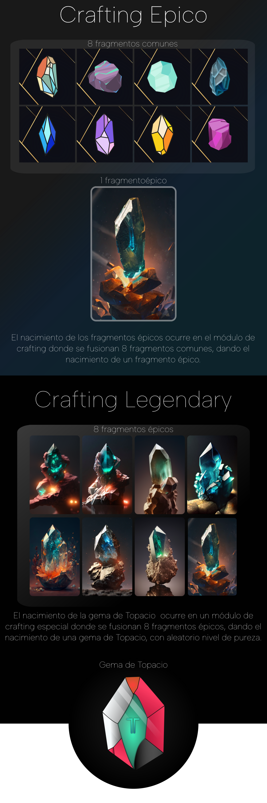

# Proyecto Topacio

<audio src="https://docs.topacio.trade/_media/1-TopacioProyect.mp3" preload="none" controls></audio>

<!-- ejemplo para VueJs
 

  <button @click="count -= 1">{{ count }}</button>

 -->
Hubo un momento en la historia de la tecnología cuando Bitcoin era solo un proyecto digital con un propósito dar empoderamiento al usuario a través de la criptografía y solventar el doble gasto sobre un activo digital y respaldado en la blockchain, apenas conocido por unos pocos visionarios que creían en su potencial. La idea de una moneda descentralizada que podría revolucionar el mundo financiero parecía descabellada, pero aquellos pocos pioneros perseveraron y vieron más allá de lo que el resto del mundo podía imaginar.

¿Recuerdas esa primera transacción de un par de pizzas por diez mil BITCOINS? Pues bien, imagina poder ser parte de un proyecto que está en su nacimiento, un proyecto que promete llevar la automatización total al mundo del trading y combinar el mundo web3 de una manera única y disruptiva. Este proyecto es TopacioTrade.

En TopacioTrade, estamos enfocados en crear una plataforma descentralizada que permita a los traders tener el control absoluto sobre sus inversiones. Nuestra visión es revolucionar el mundo financiero, y estamos seguros de que lo lograremos. Con TopacioTrade, no tendrás que preocuparte por intermediarios o terceros que controlen tus inversiones, donde realmente poseas el control total.

¿Te imaginas ser parte de algo grande?, algo que está en su nacimiento, En TopacioTrade, estamos buscando personas apasionadas que quieran unirse a nuestro equipo y ayudarnos a crear algo increíble. Si eres un apasionado de la tecnología y la innovación, entonces este es el proyecto para ti, comparte, difunde y apoya, participa de forma activa.

Te invitamos a conocer más sobre TopacioTrade, a ser parte de nuestra comunidad y a ayudarnos a revolucionar el mundo financiero. Juntos, podemos lograr grandes cosas y crear un futuro mejor para todos. ¡Únete a nosotros en TopacioTrade y sé parte de la revolución crypto y descentralizado!

<audio src="https://docs.topacio.trade/_media/2-TopacioProyect.mp3" preload="none" controls></audio>

Imagina que tienes la oportunidad de ser parte de un proyecto en nacimiento que está llevando el trading a un nivel completamente nuevo. TopacioTrade es un proyecto descentralizado que está centrado en la automatización total del trading y, lo mejor de todo, combina todo el mundo web3 en una plataforma disruptiva y única.

¿Qué significa esto para ti? Bueno, en primer lugar, significa que estás en el comienzo de algo grande. Estás en el punto de partida para una plataforma que está diseñada para cambiar el juego en el mundo de las criptomonedas y el trading.
En segundo lugar, significa que tienes la oportunidad de tener un control absoluto sobre tus activos. Con TopacioTrade, siempre tendrás el control total de tus inversiones y transacciones. Nadie más tendrá acceso a tus fondos o información personal, lo que significa que podrás operar con total confianza y seguridad.

Por último, pero no menos importante, TopacioTrade es una oportunidad para ser parte de una comunidad en crecimiento. Con la creciente popularidad de las criptomonedas y el trading descentralizado, estás en el lugar correcto en el momento adecuado. Puedes conectarte con otros traders y entusiastas de todo el mundo y ser parte de un movimiento que está revolucionando la forma en que se hace el trading.
Entonces, ¿te animas a unirte a nosotros en este emocionante viaje? ¡No te pierdas la oportunidad de ser parte de algo grande! Conoce más sobre TopacioTrade y descubre cómo puedes ser parte de esta revolución en el mundo del trading. ¡Te esperamos!

El proyecto Topacio Trade es una herramienta diseñada para apoyar a los traders, inversionistas y personas interesadas en el mundo de las criptomonedas a tomar decisiones acertadas en los diversos escenarios de volatilidad del mercado.

¿Cómo podemos identificar el mejor precio para abrir una posición en el mercado de las criptomonedas? ¿Cómo podemos evitar caer en trampas de manipulación de precios por parte de aquellos que mueven el mercado? Estas son algunas de las preguntas que nos hemos hecho antes de iniciar el desarrollo de Topacio Trade.

Nuestro equipo de expertos ha llevado a cabo varios estudios, análisis y pruebas para recopilar información congruente que ha sido aplicada a un análisis efectivo en diversos escenarios del mercado, lo que ha dado lugar a la creación de Topacio Trade.

Esta herramienta está diseñada para operar en los extremos del mercado, analizando y seleccionando los mejores momentos para comprar y vender criptomonedas en el mercado spot y de futuros, evitando así los rangos. Con una efectividad del 90% en distintas operativas temporales, Topacio Trade realiza lanzamientos automatizados de compra y venta de acuerdo a la configuración fijada por el usuario, conforme a sus planes de trading y preferencias de inversión.

Pero Topacio Trade no es solo una herramienta potente y efectiva, también ofrece una experiencia interactiva para el usuario y cuenta con su propio token de gobernanza llamado "TOPACIO" y token de recompensas "TMINE". Además, los usuarios pueden acceder a un ecosistema que combina todo el mundo Web3 y cuenta con un NFT Único en su tipo y con utilidad para utilizar el sistema automatizado y estos NFT se podrán comprar y vender en un módulo de marketplace independiente, o se podrán hacer staking y recibir el token de TMINE como recompensa, dando empoderamiento y control al usuario, orientado a la funcionalidad en el mundo real.

En Topacio Trade, estamos comprometidos en apoyar a los traders, inversionistas y personas interesadas en el mundo de las criptomonedas a tomar decisiones acertadas en los diversos escenarios de volatilidad del mercado. Con nuestra herramienta, podrás evitar pérdidas de capital y quedar atrapado con malas posiciones a largo plazo, y aprovechar al máximo las oportunidades que ofrece el mercado. Únete a nosotros y descubre un nuevo nivel de trading.

> Para estar al dia de las actualizaciones oficiales y eventos de `Topacio Trade`, te recomendamos seguir el canal oficial de twitter [@topacioTrade](https://twitter.com/TopacioTrade).

# Las características del proyecto Topacio 

Son únicas y disruptivas, ofreciendo una herramienta completamente funcional que se ejecuta en la cadena de bloques de Polygon. Esta red de capa 2 permite que las aplicaciones descentralizadas se ejecuten en una red rápida, interoperable y con comisiones menores en comparación con Ethereum. Los usuarios pueden acceder al ecosistema de Topacio Trading utilizando su dirección de billetera de la main net de Polygon, la cual también se usa para almacenar los fragmentos NFT necesarios para armar un NFT completo de TOPACIO.

Al poseer estos NFT's, los usuarios pueden acceder a diferentes funcionalidades de trading, automatizando sus operaciones tanto en el mercado spot como en el mercado de futuros. La plataforma ofrece la opción de comprar y/o vender automáticamente en puntos de quiebre absoluto del mercado, aprovechando el movimiento en tendencia de punta a punta. Además, Topacio Trading cuenta con una economía sana y un módulo de crafting que permite a los usuarios forjar auténticas gemas y destruir NFTs por medio del crafting dando el nacmiento de una mejorada, generando así una quema constante y una economía saludable dentro de la plataforma.

# Que son los Fragmentos de Gema NFT's

La generación génesis de fragmentos es la colección inicial representada por 24 variedades de fragmentos de gemas comunes. Los cuales son coleccionables, además a todos los holders iniciales que alcancen a reunir 8 fragmentos sin importar la variedad, pondrán craftear (fusionar) en su liberación un NFT épico, el cual posee mejores rendimientos que los comunes a su vez estos Épicos al fusionarse 8 darán el nacimiento de 1 NFT Completo de Topacio (totalmente funcional), cada fragmento épico que “fusione” el usuario representa una de las caras del logo de topacio, en este módulo cabe destacar que al realizar el crafting del NFT de Topacio esos 8 fragmentos son quemados. Los NFT’s de Topacio son únicos, ya que podrán ser de cualquier rareza y contar con distintos atributos, aumentando su escasez, exclusividad y usabilidad. 

Los fragmentos de gemas NO ESTARÁN disponibles todo el tiempo para su minteo y crafting, puesto que en su etapa inicial se conseguirán exclusivamente en temporadas de eventos, los cuales se irán dando a conocer a los participantes interesados, todo por medio de whitelist inscribiendo sus billeteras de polygon. Esta será en principio la única forma para ingresar al proyecto de Topacio Trading.

  

<iframe width="560" height="315" style="margin: 20px 0%;" src="https://www.youtube.com/embed/QthXbOpS5AA" title="YouTube video player" frameborder="0" allow="accelerometer; autoplay; clipboard-write; encrypted-media; gyroscope; picture-in-picture" allowfullscreen></iframe>

# ¿Qué son las Subscripciones?

Son 31 días de acceso al ecosistema de Topacio, a demás podrás unirte al canal privado de Telegram de la  comunidad exclusiva y tendrás disponible el canal del bot de notificaciones para que no te pierdas los movimientos del mercado y las mejores oportunidades que te brinda para realizar tus trade. 
Por cada subscripción el usuario obtiene un Ticket alojado en la blockchain, por cada 3 tickets acumulados podrás canjearlos por fragmentos de Gema los cuales se podrán utilizar para crear una Gema completa de Topacio, además podrás canjear  premios adicionales de las bóvedas de Eventos.

# ¿Como obtener fragmentos de gema?

En su etapa inicial las subscripciones se habilitarán en eventos,  por tiempo y cupos limitados, este sistema de subscripciones correrá en la blockchain de polygon. Por cada subscripción adquirida se asignará un ticket, una vez el usuario reúna 3 tickets los podrá canjear por un fragmento de gema alojado en una bóveda, la cual mensualmente se abastecerá con una cantidad de fragmentos finitos y escasos ejecutados por smart contracts.

La segunda forma de obtener fragmentos es en el módulo de crafting, cuando este se encuentre activo, los usuarios que posean su NFT de Topacio podrán destruirlo, esto en caso de querer reconstruir un nuevo NFT reuniendo 8 fragmentos, haciendo esto podrá obtener una Gema con nuevos atributos y rareza, así mismo será saludable para el ecosistema, pues consistiría en la quema y escasez de una activo como lo es un NFT.

# ¿En que transformaras los fragmentos?

<iframe width="560" height="450" style="margin: 20px 0%;" src="https://www.youtube.com/embed/l0vg3l_cJ-8" title="YouTube video player" frameborder="0" allow="accelerometer; autoplay; clipboard-write; encrypted-media; gyroscope; picture-in-picture; web-share" allowfullscreen></iframe>

<iframe width="560" height="450" style="margin: 20px 0%;" src="https://www.youtube.com/embed/AhD9VKwnyGA" title="YouTube video player" frameborder="0" allow="accelerometer; autoplay; clipboard-write; encrypted-media; gyroscope; picture-in-picture" allowfullscreen></iframe>

# ¿Qué pasa con mis tickets, si se agotaron los fragmentos disponibles en ese mes?

Si al momento de querer cambiar un ticket ya no hay fragmentos disponibles, también existirá un módulo de recompensas, donde existirán distintos premios, como la extensión de una subscripción, NFT's de diferentes tipos, fragmentos, NFT's funcionales y cajas sorpresas.

Dependiendo de la recompensa se pedirán un número de tickets determinados, ya que no todas estas son de un valor único.

# Tokenomic

 

* Distribución y token de gobernanza

Todo el ecosistema de Topacio contará con la siguiente distribución, regido por su token de gobernanza 100% funcional y de utilidad real, en algunos casos brindando rendimientos en su ecosistema DEFI en Staking Block y Flexible.

- 10% Equipo - Bloqueado a 18 meses. Transcurrido el periodo de Bloqueo max 20% cada 3 meses (equivalente 2% ).
- 5% Plataforma del ecosistema Topacio, escalabilidad y Desarrollo.
- 30% Módulo Staking Bloqueado - bobeda de Staking Dedicada APIS de rendimiento Anual y Flexible.
- 12% Framing.
- 3% Ronda Semilla Bloqueado (12 meses).
- 5% Venta Privada Bloqueado (12 meses).
- 5% Venta Pública (quickswap).
- 1% AirDrop Financiado por Partners.
- 5% partners inversión privada (Bloqueado a 12 meses) liberación 25% cada 3 meses
- 5% Marketing
- 5% Recompensas, plataformas y eventos distribuidos a 12 meses  durante el primer a#o (0.416% máximo mensual en ecosistema Topacio)
(recompensas por duración de staking [bonus] / trades exitosos / Eventos / financiación de NFT's otorgados en eventos)
- 4% Tesorería.
- 10% Bloqueado negociación exchanges max 3% por exchange.

    <canvas id="tokenomic-chart" width="400" height="400"></canvas>

#  Ecosistema Topacio

El ecosistema Topacio Trade contará con su Token de gobernanza  nativo (TOPACIO) el cual tendrá uso 100% integrado a todo su ecosistema, el cual poseerá un entorno rico en funcionalidades y uso en el mundo real. Cuando un usuario, poseedor de un NFT de Topacio quiera colocar automatizaciones de acuerdo a sus preferencias Gustos y estrategias, lo hará en forma de transacción en la blockchain de polygon, esta transacción se firmara desde su billetera web3 descentralizada y se cobrara una pequeña comisión en el Token de Gobernanza TOPACIO.

El usuario contará con un Marketplace independiente, desde el cual podrá Obtener un NFT de Topacio, para realizar dicha transacción el token que utilizara para pagar por este activo será el token de gobernanza TOPACIO, incentivando su uso y consumo.
Cabe destacar que al alcanzar un minteo sobre los primeros 1000 NFT generados exclusivamente se podrán mintear con Topacio Token de gobernanza. Los NFT de su temporada Génesis será publicada y abierto el mint por periodos cortos y en eventos exclusivos.

Dando uso completo y demanda de su Token en todo su ecosistema, aparte de su funcionalidad y consumo activo, el token Topacio es sumamente escaso, e incentiva el Staking para todos sus holder, con bóvedas de staking bloqueado contarán con rendimientos tanto anuales, en sus módulos de staking y framing pudiendo potenciar tu staking agregando tus NFT.

# Utilidad del token
    
    ¿Cuál será la utilidad del token?
    ¿Cuál es el valor de poseer el token o será de especulación? 
    ¿Para qué se usa el Token?.

- Fungirá como Token único de gobernanza, con la existencia única de 100.000.000 (100 millones de tokens únicamente).

- A futuro exclusivamente se adquirirán o pagarán las suscripciones a la plataforma Topacio únicamente con topacio, es decir, las personas que deseen suscribirse, necesitarán pagar su suscripción en Topacio, ocasionando demanda del mismo  y necesidad del token, Ejemplo si la suscripción mensual sale en 15 $, deberán tener el equivalente a 15 $ en Topacio (Demanda continua de Topacio). 

- El NFT para su Adquisición después de la venta semilla  exclusivamente  se podrá adquirir con Topacio (Deberán comprar su Token de Gobernanza), con este NFT es con que se podrán acceder a las automatizaciones, cuando estén listas (Más Demanda por Topacio).

- cuando se lance la venta pública del token en quickswap se podrá comprar y vender libremente y las personas podrán especular con su precio, o holdear como lo deseen.

- El Marketplace donde se negociarán los NTF, única y exclusivamente, cobrará en su token de gobernanza (TOPACIO).

- Staking el 35% del supply (existencia), se encontrará bloqueado, y repartido en módulo de Staking bloqueado dando Rendimiento anuales APR distribuido entre  todos sus Holders de acuerdo a su participación en el Staking de su Token Topacio, ocasionando la demanda del mismo para todos sus inversores.(confianza en el proyecto e inversión a largo plazo en un activo escaso)

- Automatizaciones - para la ejecución de las automatizaciones se requerirá, aparte de poseer un NFT de Topacio, se cobrará una pequeña comisión en su toquen nativo de gobernanza. (TOPACIO). RESUMEN nadie se querrá quedar sin topacio.

# Objetivos Futuros y alcances

El objetivo principal será la automatización total y en un ecosistema tokenizado con funcionalidad real y activa, expansión continua, donde sus uno de sus puntos y objetivos a completar será la ampliación e integración a múltiples exchanges e incluso abarcar el análisis del Stock Market (Mercado tradicional de acciones) Nasdaq SP500, Forex y otros.

# Calendario de desbloqueo

**RONDA SEMILLA:** 

Los inversores aportarán la capitalización inicial para fondear el proyecto en su génesis, y la liquidez recaudada en esta ronda será bloqueada para ayudar al establecimiento del precio base que tendrá cuando se lance la venta pública. Esta ronda será privada y el precio de ronda se estima alrededor de 0.10, aunque aún está en estudio. Además, el tiempo de vesting para esta ronda es de 18 meses (Block) y la liberación será del 20% cada 3 meses después de haber pasado el tiempo de bloqueo.

**RONDA PRIVADA - PRE VENTA** 

El acceso se realizará a través de Whitelist y se limitará la cantidad de inversión en USD por persona. Las condiciones para ser elegido en la Whitelist se informarán con suficiente tiempo de anticipación para que los interesados en participar en esta ronda se preparen. El precio del token adquirido en esta ronda se estima alrededor de 0.15. Además, el vesting para esta ronda será de 12 meses (Block) y la liberación será del 20% cada 3 meses.

**VENTA PÚBLICA Y LANZAMIENTO EN QuickSwap**

Finalmente, en la venta pública y lanzamiento en QuickSwap, no habrá bloqueo y la venta será abierta al público en general. Este detallado calendario de desbloqueo permite a los inversores saber exactamente cuándo y cómo se desbloquearán sus fondos, lo que ayuda a proporcionar transparencia y seguridad en el proceso de inversión.

**¿Qué plan se tiene en mente para que la capitalización de mercado prevenga manipulaciones?**

Para prevenir manipulaciones en la capitalización de mercado del proyecto, se tiene en mente implementar medidas como la programación de smartcontracts que limiten las transacciones de venta o compra a un máximo del 1% del supply. Esta medida está en evaluación, ya que muchos exchanges exigen una cantidad mayor para la inclusión y el listado.

Además, se busca diversificar al máximo la distribución de la venta privada o pre-venta del proyecto, para atraer a una gran cantidad de público y evitar que un grupo reducido tenga una influencia desmedida en el mercado. Se planea realizar una campaña de marketing y publicidad organizada y fuerte durante al menos un mes y medio antes del lanzamiento, para maximizar la captación de inversores y lograr una distribución equitativa de los tokens en circulación. Con estas medidas se busca evitar la manipulación del mercado y lograr una capitalización de mercado saludable y estable a largo plazo.

# Roadmap

 

Desarrollo Proyecto a largo plazo y de utilidad en el mundo real

- core núcleo Inicial Base integraciones con Binance y Bybit
- Validación y certificación de múltiples capas de análisis y estrategias, en múltiples escenarios y tendencias.
- Preparación y desarrollo de la comunidad Topacio Trade.
- Integraciones funcionales en la blockchain.
- Desarrollo de Token de gobernanza
- Desarrollo de NFT's y utilidad real ligada a sus automatizaciones y consumos.
- Ronda de Inversión Privada y Venta Semilla (Block - 12 meses).
- Pre-sale. (Block flexible - Liberación cada 3 meses)
- AirDrop (Patrocinado) por financiación privada
- Integración de Oráculos.
- Creación de Marketplace.
- Desarrollo de Módulos de Staking.
- Escalabilidad progresiva e integración con varios exchanges.
- Desarrollo de Automatizaciones integradas a los NFT's.
- Ampliación y extensión a mercados tradicionales del Stock Market (SP500 & nasdaq).
- (mejora continua) - Topacio nunca para de evolucionar.
